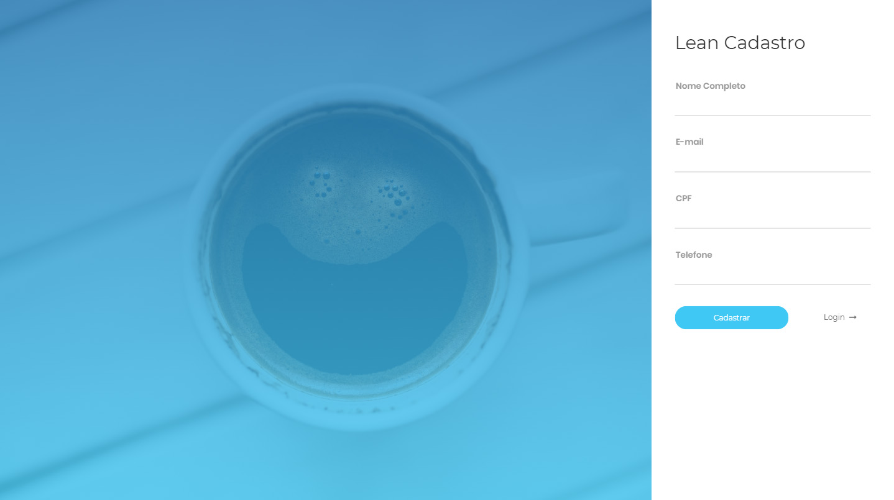

# Teste de Front-end
Teste para candidatos à vaga de desenvolvedor Front-end na Leanwork.

### O Desafio

Seu objetivo é criar um simples app que deve conter duas páginas, uma que exibe um formulário com os campos abaixo, e outra que liste os dados cadastrados.

* Nome completo
* CPF
* Telefone
* Email

### Instruções:
 - Deve ser possível criar, listar e excluir os dados cadastrados pelo formulário;
 - Fazer a persistência dos dados no localStorage ou IndexedDB;
 - Implemente o HTML/CSS da tela com base no layout disponível abixo;
 - A página deve ser responsiva;
 - Para a interação do formulário utilize preferencialmente angularjs e/ou jQuery;

### Você pode:
 - Utilizar bibliotecas css como compass, bourbon, animatecss ou outras;
 - Utilizar componentes do bower.
 
### O que esperamos:
 - Dê suporte a IE10+, Chrome, Safari e Firefox.
 - Padrão de Projeto e boas práticas;
 - Crie um passo a passo de como rodar sua aplicação (Sugestão);
 - Crie uma breve descrição da solução utilizada.

### Plus:
Uso de task runner
Uso de pré-processador css;
Testes End to End;

## Guia de estilo

### Linear na Imagem
 - Cor inicial: #40c8f4
 - Cor final: #2179b5

### Label
 - Cor da fonte: *#999999*.

### Input:
 - Cor da fonte sem foco: *#efeeed*.
 - Cor da fonte com foco: *#555555*.
 - Cor da borda: *#dbdbdb*.

### Botão Abilitado:
 - Cor da fonte com foco: *#ffffff*.
 - Cor de background: *#40c8f4*.

### Botão Hover:
 - Opacidade do botão com hover: 70%.

### Botão Desabilitado:
 - Cor da fonte sem foco: *#dddcdc*.
 - Cor de background: *#f6f6f6*.

Use sua criatividade para criar a página para listar os dados cadastrados 

### Exemplo final

** Use sua criatividade para criar a página para listar os dados cadastrados **